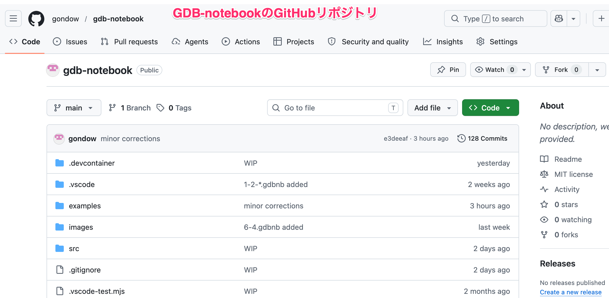
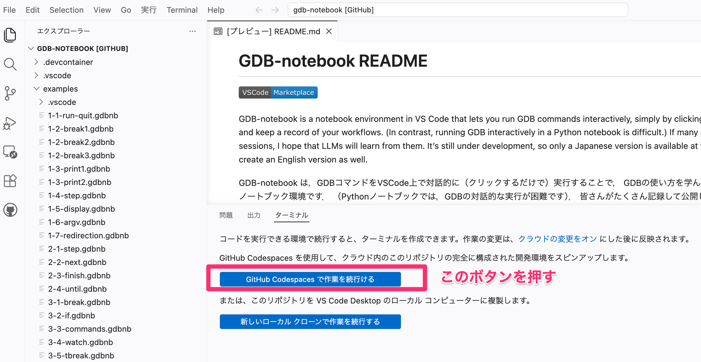
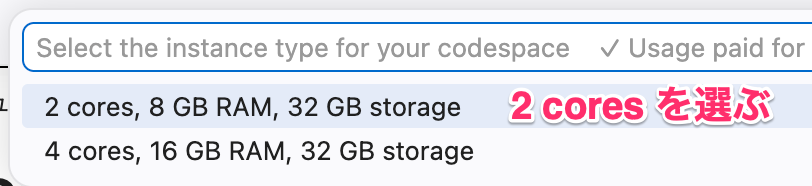
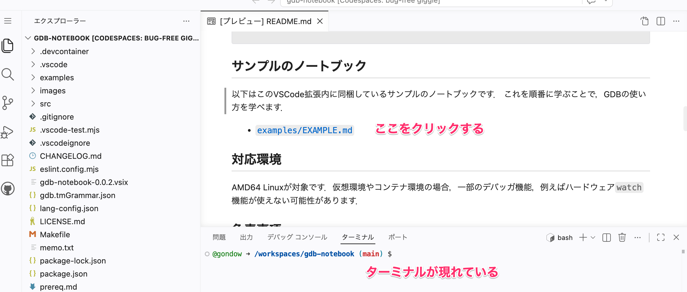
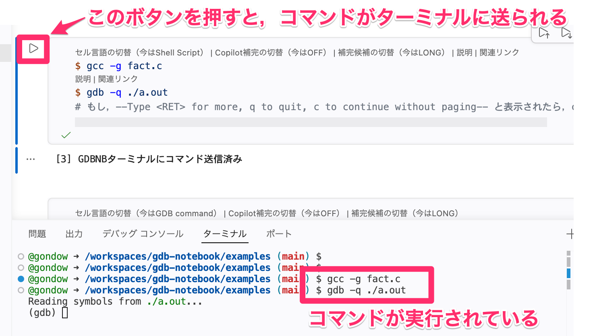
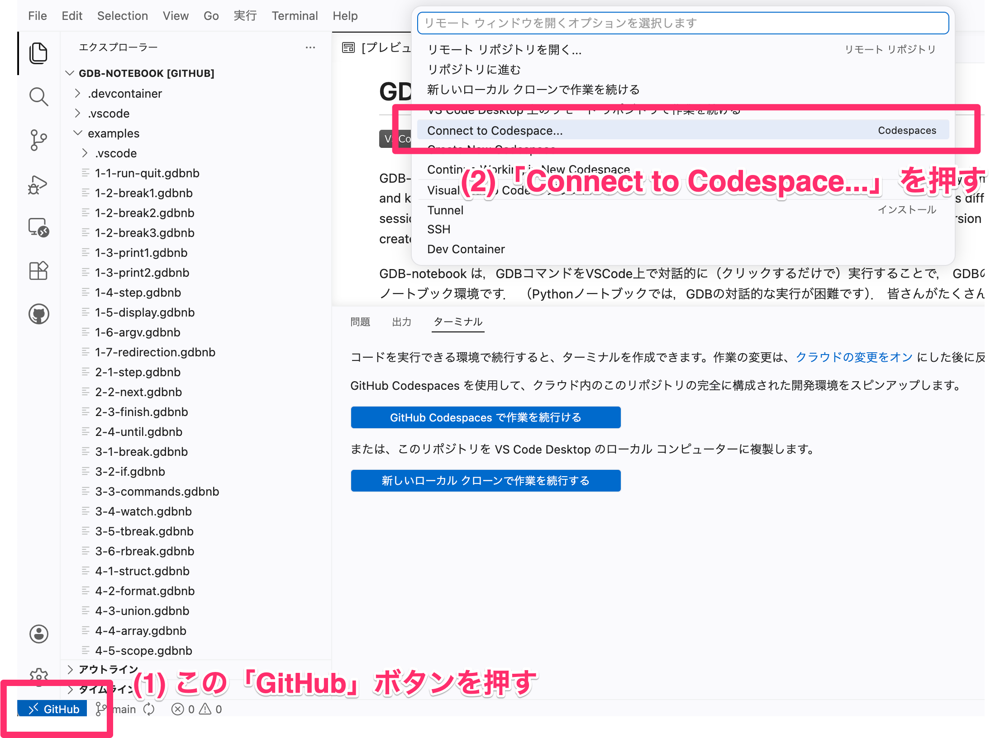

# GitHub Codespacesを使って，GDB-notebookのサンプルを動作させる方法

## GitHub Codespacesとは？

- GitHubが提供するクラウド上のコンテナ環境で，AMD64 Linuxの開発環境として使えます．GitHubアカウントが必要です(無償でOK)．
- (2 CPUの場合)一ヶ月あたり60時間まで無料で使えます．
  ストレージは15GB/月まで無料です．(2026年5月現在)
- 通常，操作を停止してから30分で，コンテナ環境は自動停止し，無料枠の時間を節約してくれます．

## 使い方

1. GDB-notebookの[GitHubリポジトリ](https://github.com/gondow/gdb-notebook)を表示する．

2. そこで「.」（ピリオド）キーを押す．
   あるいはGDB-notebookの[github.dev](https://github.dev/gondow/gdb-notebook)を開く．
   すると，VSCode for the Webがブラウザ上に表示される．「GitHub Codespacesで作業を続行する」を押す．

3.  「2 cores」か「4 cores」を選べと言われるので，「2 cores」を選ぶ．
    (2 coresの方が，使用できる時間が多いので)
   「Setting up remote connections: Building codespace...」と言われるので，
   1〜2分待つ．

4. ターミナルが表示されればOKです．`README.md`のプレビューから，
   `examples/EXAMPLE.md`を開き，`1-1-run-quit.gdbnb`をクリックします．
   セルの実行ボタンを押して，ターミナル上で`gcc`などを実行できれば成功です．

5. 2回目からは「GitHub Codespacesで作業を続行する」を押さずに
   (押すと新しいコンテナ環境が作られてしまいます)，
   左下の「GitHub」ボタンを押して，「Connect to Codespace...」を選び，
   表示されるあなたのCodespaceを選択して下さい．					     

